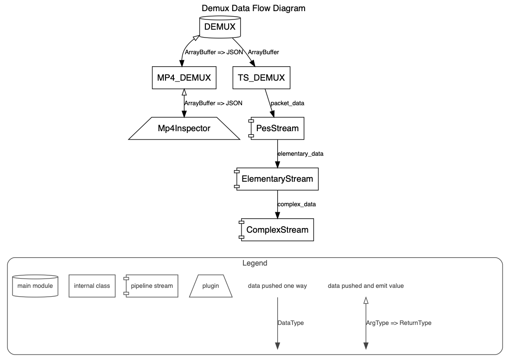

# 一个用于解复用 ts/mp4/flv 的工具。

> 这个工具可以在 HTML5 播放器或 Node.js 等平台上使用

[](https://www.npmjs.com/package/demuxer)
[](https://www.npmjs.com/package/demuxer)
[](https://app.travis-ci.com/goldvideo/demuxer)
[](./)

## 演示

- [解复用 MP4](./doc/examples/demux-mp4.html)
- [解复用 TS](./doc/examples/demux-ts.html)
- [解复用 FLV](./doc/examples/demux-flv.html)

## 数据流图



## 功能特性

- 支持推送流数据进行解复用
- 支持 Tree-shaking（完整代码版本不需要担心引用大小，当业务只引用某种格式的解码时，整体代码支持 tree-shaking）
- 支持任意组合打包（这些格式可以根据需求打包，用户不需要打包所有代码）

## 如何开始？

1. 安装

   ```shell
   npm i demuxer
   ```

2. 设置

   ```js
   import { TSDemux, FLVDemux, MP4Demux, Events } from 'demuxer';

   const demux = new TSDemux();
   // const demux = new FLVDemux();
   // const demux = new MP4Demux();

   // 数据以流的方式输出，
   // 第一个数据会尽快发出。
   demux.on(Events.DEMUX_DATA, (data) => {
     // 处理解复用后的数据
     console.log(data);
   });

   demux.on(Events.DONE, () => {
     console.log('解复用完成');
   });

   // 推送数据
   demux.push(bufferData);
   demux.flush();
   ```

## 支持的格式

| 格式 | 解复用器 | 状态 |
|------|----------|------|
| TS | TSDemux | ✅ 支持 |
| MP4 | MP4Demux | ✅ 支持 |
| FLV | FLVDemux | ✅ 支持 |

## API

### TSDemux

```js
const demux = new TSDemux();

// 推送数据
demux.push(buffer);

// 刷新缓冲区
demux.flush();

// 监听事件
demux.on(Events.DEMUX_DATA, (data) => {
  // data 包含：
  // - type: 'video' | 'audio'
  // - payload: 解复用后的数据
  // - timestamp: 时间戳
});
```

### MP4Demux

```js
const demux = new MP4Demux();

demux.on(Events.DEMUX_DATA, (data) => {
  // 处理 MP4 解复用数据
});

demux.push(mp4Buffer);
demux.flush();
```

### FLVDemux

```js
const demux = new FLVDemux();

demux.on(Events.DEMUX_DATA, (data) => {
  // 处理 FLV 解复用数据
});

demux.push(flvBuffer);
demux.flush();
```

## 事件

| 事件 | 说明 |
|------|------|
| `Events.DEMUX_DATA` | 解复用数据事件 |
| `Events.DONE` | 解复用完成事件 |
| `Events.ERROR` | 错误事件 |

## 许可证

MIT

---

> 项目地址：[goldvideo/demuxer](https://github.com/goldvideo/demuxer)
> npm 包：[demuxer](https://www.npmjs.com/package/demuxer)
