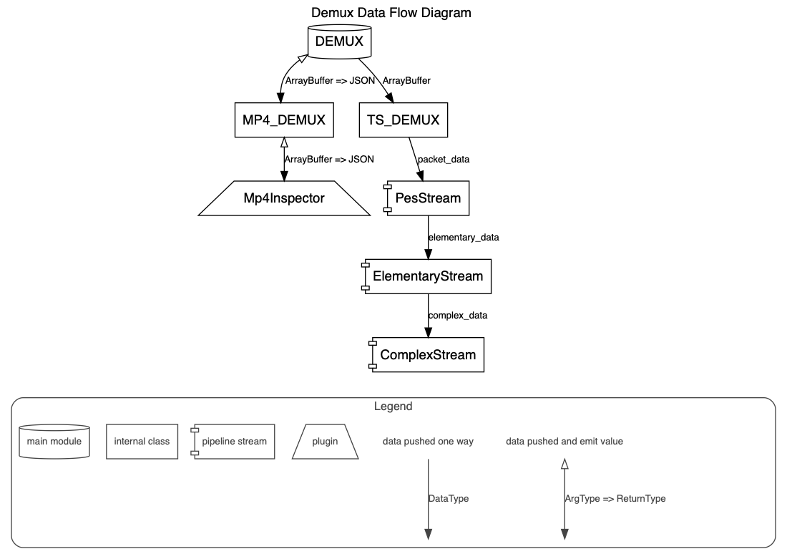

# 使用 typescript 编写的解码 TS/MP4/FLV 工具

> 该工具可用于 HTML5 播放器或者 Node.js 等平台

## 数据流向图



## 特性

-   Demuxer 支持流式数据推送
-   支持代码精简 Tree-shakable（使用全代码打包的版本也不用担心引用大小，当业务只引用某一个格式的解码时，整体代码支持 tree-shaking）
-   任意组合打包（这几种格式可以根据需求打包，使用者不需要打包全部代码）

## 示例

-   [解码 MP4](./doc/examples/demux-mp4.html)
-   [解码 TS](./doc/examples/demux-ts.html)
-   [解码 FLV](./doc/examples/demux-flv.html)

## 如何开始？

1. 安装

    ```shell
    npm i demuxer
    ```

2. 使用

    ```javascript
    import { TSDemux, FLVDemux, MP4Demux, Events } from 'demuxer';

    const demux = new TSDemux();
    // const demux = new FLVDemux();
    // const demux = new MP4Demux();

    // 数据是按照流式方式吐出，尽快吐出解析出来第一个数据
    demux.on(Events.DEMUX_DATA, (e) => {
        console.log(e);

        // if (e.stream_type === 15) {
        //     console.log(e)
        // }
    });
    
    // 当push进来的数据都解析并吐出后，会产生如下事件。用来告诉使用者数据已经解析完毕
    demux.on(Events.DONE, (e) => {
        // 数据消耗完毕之后，管道进行了flush动作
    });

    // buffer -> video bytes ArrayBuffer
    demux.push(buffer, {
        // 本解码器支持推送部分数据
        // 当done设置为true后，如果数据解码完毕没有剩余数据，则认为数据已经推送完毕，Events.DONE才会发出。
        // 当done设置为false后，Events.DONE不会发出，等待后续数据推送
        done: true
    });
    ```

3. Debug 开启的方式

    ```$js
    var demuxer = new TSDemux({
        debug: true
    });
    ```

4. Demuxer Options

    ```$js
    let options = {
        // 设置 options.debug = true; 后在JS控制台，可以打印日志.
        debug: true
    };

    var demuxer = new TSDemux(options);
    // var demuxer = new MP4Demux(options);
    // var demuxer = new FLVDemux(options);
    ```

## 关于解码 MP4 原始数据(h264/hevc/aac)的问题

需要开发者解析 mp4 头部分数据后，再根据头中描述的信息，定位 mdat 中具体到数据信息位置

## 关于解码 FLV 格式的方法

## 关于如何用 Worker 集成 Demuxer

因为第三方很可能自己内部有 worker 工具，为了不和 worker 工具产生冲突及冗余，worker 由使用者自行实现。

## 文档语言版本

> [English Readme](./README.md)

## LICENSE

[MIT](LICENSE)
